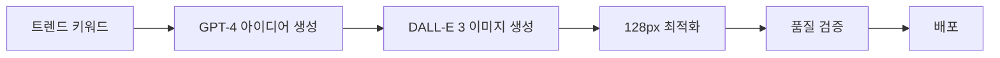

# AI 기반 실시간 트렌드 이모지 생성 전략

> 고퀄리티, 센스있고 실제로 사용되는 이모지 팩을 만들기 위한 AI 파이프라인 구축 전략

## 🎯 핵심 목표

**"진짜 쓸만한" 이모지 = 실시간 트렌드 + 현지화 + 고퀄리티 생성**

- MZ 세대가 실제로 사용하는 밈과 표현
- K-Culture (K-pop, K-drama) 트렌드 반영
- 24시간 내 트렌드 반영 속도
- 커뮤니티 기반 큐레이션

## 📊 1. 데이터 소싱 자동화

### 트렌드 수집 봇 아키텍처

```python
class TrendCollector:
    sources = {
        'twitter': 'K-pop 팬덤 밈, 실시간 반응',
        'tiktok': 'MZ 유행어, 챌린지',
        'naver': '한국 실시간 검색어',
        'youtube': '드라마/예능 명대사',
        'dcinside': '신조어, 인터넷 밈',
        'fmkorea': '커뮤니티 밈'
    }
    
    def collect_weekly_trends(self):
        # 주간 트렌드 수집 및 분석
        # 중복 제거 및 인기도 순위 매기기
        # 이모지화 가능한 키워드 필터링
        pass
```

## 🤖 2. AI 생성 파이프라인

### A. 텍스트 밈 생성 프로세스



### B. 실제 구현 코드

```python
import openai
import replicate
from PIL import Image

class EmojiGenerator:
    def __init__(self):
        self.style_prompt = "minimalist slack emoji style, 128x128px, transparent background"
    
    def generate_kpop_pack(self, artist, trend):
        """K-pop 아티스트 기반 이모지 팩 생성"""
        # 1. 팬덤 용어 수집
        fandom_terms = self.scrape_fandom_wiki(artist)
        
        # 2. 최신 밈 수집
        recent_memes = self.get_twitter_trends(f"#{artist}")
        
        # 3. AI 프롬프트 생성
        prompts = []
        for meme in recent_memes[:20]:
            prompts.extend([
                f"Cute chibi {artist} member saying '{meme}', {self.style_prompt}",
                f"Minimalist emoji of {meme} gesture, {self.style_prompt}",
                f"Korean text '{meme}' with decorative elements, {self.style_prompt}"
            ])
        
        # 4. 이미지 생성 (Stable Diffusion)
        emojis = []
        for prompt in prompts:
            output = replicate.run(
                "stability-ai/stable-diffusion",
                input={
                    "prompt": prompt,
                    "width": 512,
                    "height": 512,
                    "num_outputs": 4
                }
            )
            # 128px로 리사이즈 및 최적화
            for img_url in output:
                emojis.append(self.process_emoji(img_url))
        
        return emojis
    
    def generate_kdrama_pack(self, drama_title):
        """K-드라마 명대사 이모지 팩 생성"""
        # 드라마 명대사 수집 → 이모지화
        pass
    
    def generate_mz_office_pack(self):
        """MZ 세대 오피스 라이프 팩 생성"""
        terms = [
            ("칼퇴각", "person running with knife emoji style"),
            ("야근각", "coffin emoji with office background"),
            ("점메추", "lunch roulette wheel emoji"),
            ("금욜", "sparkling TGIF text emoji"),
            ("월요병", "sick face with monday text"),
            ("불금", "fire friday party emoji")
        ]
        # 각 용어별 이모지 생성
        pass
```

## 📦 3. 즉시 히트할 팩 아이디어

### 🎬 K-Drama 명대사 팩
- **타겟**: 드라마 팬, 오피스 워커
- **예시 이모지**:
  - "기분이 좋아서 그래" (눈물의 여왕)
  - "사랑은 개뿔" (나의 해방일지)  
  - "밥 먹었어?" (모든 한국 드라마)
  - "그게 나야" (대표 자신감 표현)
  - "미안하다 사랑한다" (클래식)

### 💼 MZ 오피스 라이프 팩
- **타겟**: 20-30대 직장인
- **예시 이모지**:
  - "칼퇴각" - 칼 들고 뛰는 애니메이션
  - "야근각" - 관 이모지
  - "점메추" - 점심 메뉴 룰렛
  - "회식각" - 소주잔 애니메이션
  - "연차각" - 비행기 이륙
  - "월급날" - 돈다발 애니메이션

### 🎵 K-pop 스탠 필수팩
- **타겟**: K-pop 팬덤
- **예시 이모지**:
  - 각 그룹별 응원봉 (아미밤, 캔디봉 등)
  - "출근길 덕질" 
  - "티켓팅 실패" - 울고있는 이모지
  - "컴백 D-1" - 카운트다운
  - "입덕" - 하트 눈
  - "탈덕" - 깨진 하트

### 🍜 한국 음식 리액션 팩
- **타겟**: 푸디, 먹방 팬
- **예시 이모지**:
  - "JMT" - 존맛탱 애니메이션
  - "핵불닭" - 불 뿜는 이모지
  - "소맥타임" - 맥주+소주 조합
  - "치맥" - 치킨+맥주
  - "떡볶이 땡겨" - 떡볶이 애니메이션

### 🎮 게임/인터넷 밈 팩
- **타겟**: 게이머, 온라인 커뮤니티 유저
- **예시 이모지**:
  - "ㅈㅈ" - GG 항복
  - "ㅋㅋ루삥뽕" - 웃음 폭발
  - "개추" - 강력 추천
  - "ㄹㅇㅋㅋ" - 진짜 웃김
  - "극혐" - 극도로 싫음

## 🛠 4. 기술 스택

### 실시간 트렌드 파이프라인

```javascript
const trendPipeline = {
  // 1. 데이터 수집 레이어
  collectors: [
    'twitter-api',         // 실시간 해시태그
    'youtube-data-api',     // 인기 댓글
    'naver-search-api',     // 실시간 검색어
    'papago-api',          // 번역
    'custom-crawler'       // 커뮤니티 크롤러
  ],
  
  // 2. AI 생성 레이어
  generators: [
    'stable-diffusion-xl',  // 오픈소스 이미지 생성
    'dalle-3',             // 고퀄리티 생성
    'midjourney',          // 스타일 일관성
    'canvas-api'           // 텍스트 오버레이
  ],
  
  // 3. 후처리 레이어
  processors: [
    'remove-bg',           // 배경 제거
    'resize-128',          // Slack 사이즈
    'optimize-gif',        // GIF 최적화
    'quality-check'        // 품질 검증
  ]
};
```

### 자동화 워크플로우

```yaml
# .github/workflows/emoji-generation.yml
name: Weekly Emoji Generation

on:
  schedule:
    - cron: '0 0 * * MON'  # 매주 월요일
  workflow_dispatch:        # 수동 실행 가능

jobs:
  generate:
    steps:
      - name: Collect Trends
        run: python scripts/collect_trends.py
        
      - name: Generate Ideas
        run: python scripts/generate_ideas.py
        
      - name: Create Emojis
        run: python scripts/create_emojis.py
        
      - name: Quality Check
        run: python scripts/quality_check.py
        
      - name: Deploy to Packs
        run: python scripts/deploy_packs.py
```

## 👥 5. 큐레이션 시스템

### AI + 인간 협업 모델

```
주간 사이클:
1. [월] AI가 트렌드 기반 100개 생성
2. [화-목] 커뮤니티 투표 (Discord/Slack)
3. [금] 상위 20개 선정 및 다듬기
4. [토] 정식 배포
5. [일] 피드백 수집 → AI 학습
```

### 투표 시스템 구현

```typescript
interface EmojiCandidate {
  id: string;
  imageUrl: string;
  prompt: string;
  votes: number;
  feedback: string[];
}

class CommunityVoting {
  async startWeeklyVote(candidates: EmojiCandidate[]) {
    // Discord/Slack에 후보 게시
    // 반응 이모지로 투표
    // 48시간 투표 기간
    // 상위 20% 자동 선정
  }
}
```

## 💰 6. 수익 모델

### 티어 시스템

```
🆓 Free Tier
- 기본 팩 10개
- 월 100개 이모지 제한
- 광고 표시

💎 Premium ($9.99/월)
- 모든 팩 접근
- 신규 트렌드 즉시 접근
- 광고 제거
- 투표 가중치 2배

🏢 Enterprise ($99/월)
- 커스텀 기업 로고 이모지
- 전용 팩 생성
- API 접근
- 우선 지원
```

### 추가 수익원
- 독점 아티스트 팩 (라이선스 계약)
- 커스텀 이모지 제작 서비스
- 이모지 NFT 발행
- 브랜드 콜라보 팩

## 🚀 7. MVP 구현 계획 (1주일)

### Day 1-2: 기본 인프라
```python
# requirements.txt
openai==1.0.0
replicate==0.15.0
pillow==10.0.0
tweepy==4.14.0
fastapi==0.104.0
```

### Day 3-4: 생성 파이프라인
```python
# generate_weekly_pack.py
import openai
import replicate
from datetime import datetime

class WeeklyPackGenerator:
    def __init__(self):
        self.openai_client = openai.Client()
        self.replicate_client = replicate.Client()
    
    def generate_this_week_pack(self):
        # 1. 이번 주 트렌드 분석
        trends = self.analyze_weekly_trends()
        
        # 2. GPT-4로 아이디어 생성
        ideas = self.generate_ideas(trends)
        
        # 3. Stable Diffusion으로 이미지 생성
        emojis = []
        for idea in ideas[:30]:
            emoji = self.create_emoji(idea)
            emojis.append(emoji)
        
        # 4. GitHub에 자동 커밋
        self.deploy_to_github(emojis)
        
        return emojis
    
    def analyze_weekly_trends(self):
        prompt = """
        이번 주 한국 MZ세대 트렌드 분석:
        1. 가장 핫한 밈 5개
        2. 유행하는 신조어 5개
        3. 화제의 드라마/예능 명대사 5개
        4. K-pop 관련 이슈 5개
        
        이모지로 만들기 좋은 형태로 정리해줘.
        """
        
        response = self.openai_client.chat.completions.create(
            model="gpt-4",
            messages=[{"role": "user", "content": prompt}]
        )
        
        return response.choices[0].message.content
    
    def create_emoji(self, idea):
        output = self.replicate_client.run(
            "stability-ai/sdxl:latest",
            input={
                "prompt": f"emoji style, {idea}, 128x128px, transparent background",
                "negative_prompt": "realistic, photo, complex",
                "width": 512,
                "height": 512
            }
        )
        
        # 후처리: 리사이즈, 배경 제거
        return self.process_image(output[0])
```

### Day 5-6: 웹 인터페이스
- 투표 시스템 구현
- 실시간 프리뷰
- 다운로드 기능

### Day 7: 배포 및 테스트
- Vercel 배포
- GitHub Actions 설정
- 초기 사용자 피드백

## 📈 8. 성공 지표 (KPI)

### 단기 (1개월)
- 주간 생성 이모지: 100개
- 사용자 투표 참여: 1,000명
- 다운로드 수: 10,000회

### 중기 (3개월)
- Premium 구독자: 100명
- 커뮤니티 멤버: 5,000명
- 브랜드 콜라보: 3건

### 장기 (1년)
- MAU: 100,000명
- 수익: $10,000/월
- 이모지 라이브러리: 10,000개

## 🔑 9. 핵심 성공 요소

1. **속도**: 트렌드는 생명이 짧음 → 24시간 내 배포
2. **현지화**: 한국 정서와 문화 깊은 이해
3. **커뮤니티**: 사용자 참여형 큐레이션
4. **품질**: 실제 사용 가능한 고퀄리티
5. **반복**: 매주 꾸준한 신규 팩 출시

## 📝 10. 다음 단계

1. **즉시 실행**
   - [ ] OpenAI API 키 설정
   - [ ] Replicate 계정 생성
   - [ ] 첫 번째 테스트 팩 생성

2. **1주일 내**
   - [ ] MVP 파이프라인 구축
   - [ ] 첫 번째 주간 팩 배포
   - [ ] Discord 커뮤니티 개설

3. **1개월 내**
   - [ ] 자동화 완성
   - [ ] Premium 티어 런칭
   - [ ] 첫 브랜드 콜라보

---

*Last Updated: 2024-09-11*
*Author: AsyncSite Team*